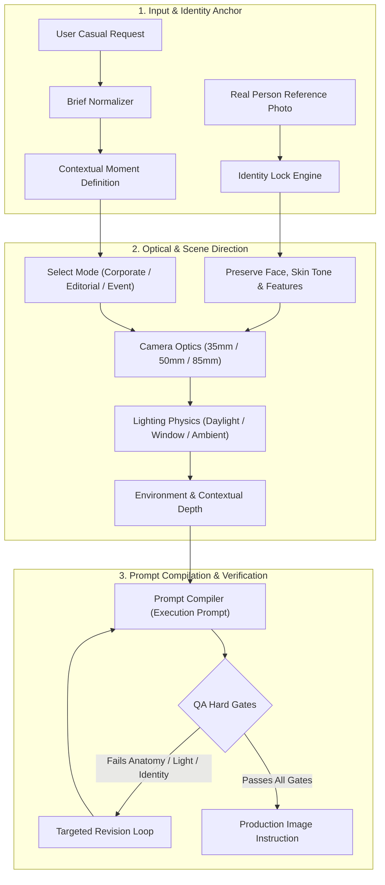

<div align="center">

# 📸 Lively Photos Director

### Universal AI Agent Skill for Natural, Human-First Photographic Direction
**Identity Preservation • Physically Coherent Light • Believable Camera Optics • Zero Synthetic Slop**

[](LICENSE)
[](https://bun.sh)
[](https://www.typescriptlang.org/)
[](https://skills.sh)
[](https://claude.ai)
[](https://deepmind.google)
[](SKILL.md)

<p align="center">
  <a href="#-overview">Overview</a> •
  <a href="#-awesome-prompt-collection">Prompts</a> •
  <a href="#-omni-channel-installation">Installation</a> •
  <a href="#-architecture">Architecture</a> •
  <a href="#-photographic-modes">Modes</a> •
  <a href="#-cli-reference">CLI Reference</a> •
  <a href="#-quality-gates--evals">Evals</a> •
  <a href="#-contributing">Contributing</a>
</p>

</div>

---

## 🌟 Overview

**Lively Photos Director** is a portable, universal AI agent skill designed to turn a real-person reference photo plus a casual scene idea into a believable, naturally photographed image prompt and direction packet.

Most AI headshots and synthetic corporate images fail because they look uncanny: hyper-smooth plastic skin, contradictory rim lighting, bizarre camera distortions, generic stock-photo grins, and random decorative clutter. 

**Lively Photos Director** enforces the discipline of a veteran documentary photographer:
- **Identity Lock**: Preserves recognizable face structure, skin tone, head covering, and stable traits without artificial beautification.
- **Physical Coherence**: Enforces plausible focal lengths (35mm, 50mm, 85mm), real depth of field, and believable ambient light sources.
- **Story-Bearing Moments**: Avoids arbitrary clutter—every person, document, screen, and prop must explain the moment.
- **Anti-Slop Hard Gates**: Prohibits plastic retouching, neon gradients, and synthetic visual residue.

---

## ✨ Awesome Prompt Collection

Need ideas before you know exactly what to ask for? The repository now includes a growing library of ready-to-use natural-photo concepts:

**[Browse the Awesome Lively Photo Prompt Collection →](prompts/AWESOME_PROMPTS.md)**

The first collection includes **48 curated prompts** across:

- corporate documentary and partnership moments
- founder, consultant, coach, and personal-brand scenes
- everyday work-life photography
- conferences and event documentary
- casual lifestyle moments
- urban and street photography
- travel and hospitality
- editorial-natural portraits

It also includes reusable action, location, camera, and lighting matrices so you can build new prompt ideas without falling back to generic AI portrait language.

---

## 🚀 Omni-Channel Installation

Installable across every modern AI harness and agent ecosystem:

### 1. Skills.sh (Vercel Registry)
```bash
# Add directly to your active project or global agent environment
npx skills add imMamdouhaboammar/lively-photos-director
```

### 2. Claude Code & Claude Desktop
```bash
# Local installation into Claude Code skills directory
mkdir -p ~/.claude/skills
git clone https://github.com/imMamdouhaboammar/lively-photos-director.git ~/.claude/skills/lively-photos-director
```

### 3. Google Antigravity & Gemini CLI
```bash
# Install into Antigravity / Gemini CLI config
mkdir -p ~/.gemini/config/skills
git clone https://github.com/imMamdouhaboammar/lively-photos-director.git ~/.gemini/config/skills/lively-photos-director
```

### 4. OpenAI Codex, OpenCode & Universal Agent Kernel
```bash
# Install into universal agent kernel or Codex
mkdir -p ~/.agents/skills
git clone https://github.com/imMamdouhaboammar/lively-photos-director.git ~/.agents/skills/lively-photos-director

# Codex specific location
mkdir -p ~/.codex/skills
git clone https://github.com/imMamdouhaboammar/lively-photos-director.git ~/.codex/skills/lively-photos-director
```

### 5. Cursor & Windsurf
```bash
# Clone into your project's .cursor directory
mkdir -p .cursor/skills
git clone https://github.com/imMamdouhaboammar/lively-photos-director.git .cursor/skills/lively-photos-director
```

### 6. Universal One-Line Installer (Bash / Curl)
```bash
# Automatically detects and installs across all installed agent harnesses
curl -fsSL https://raw.githubusercontent.com/imMamdouhaboammar/lively-photos-director/main/install.sh | bash
```

### 7. Instant Zero-Install CLI (npx / bunx)
```bash
# Run commands or validate directly without cloning
npx lively-photos-director info
bunx lively-photos-director modes
```

---

## 🏛 Architecture



---

## 🎭 Photographic Modes

| Mode | Target Scenarios | Optical & Lighting Formula | Key Guardrail |
| :--- | :--- | :--- | :--- |
| **`documentary-corporate`** | Partnership signings, boardrooms, institutional meetings, executive PR | 35mm–50mm, eye-level, soft directional daylight or clean office ambient | Neutral environment, restrained branding, unstaged body posture |
| **`candid-professional`** | Team working sessions, impromptu whiteboard discussions, modern studio work | 50mm–85mm, moderate depth-of-field, realistic workspace lighting | No forced stock-photo grins; hands engaged in natural activity |
| **`editorial-natural`** | Magazine feature profiles, thought leadership portraits, keynote speaker features | 50mm–85mm portrait length, controlled natural contrast, shallow DOF | Strict texture preservation: no airbrushed or plastic skin |
| **`everyday-lifestyle`** | Cafe remote work, travel, commuting, personal candid everyday moments | 28mm–35mm environmental angle, available ambient light, organic imperfections | Plausible asymmetry, natural fabric folds, unchoreographed surroundings |
| **`event-documentary`** | Conferences, panel discussions, exhibition floor, audience Q&A | 35mm–70mm zoom range, authentic stage lighting, contextual attendees | Background people remain contextual; subject remains clear human anchor |

---

## 🛡 Anti-Rationalization Guardrails

| Common Temptation | Binding Photographic Rule | Why This Matters |
| :--- | :--- | :--- |
| *"More cinematic lighting makes it look realistic"* | Enforce physically plausible, single dominant light sources | High drama, neon rims, and unexplained backlights expose AI generation instantly |
| *"The background needs more items to look complete"* | Include only story-bearing context (desk, document, laptop) | Clutter distracts from the subject and creates synthetic artifacts |
| *"Flawless skin looks premium"* | Preserve real skin pores, texture, and natural facial asymmetry | Over-smoothing generates the "wax museum" effect |
| *"A huge beaming smile looks friendlier"* | Direct subtle, task-appropriate facial engagement | Unnatural smiles look like generic royalty-free stock imagery |
| *"The prompt should describe every micro-detail"* | Specify identity anchor, action, optics, lighting, and constraints | Bloated prompts confuse diffusion models and dilute priority rules |

---

## 💻 CLI Reference

The repository bundles a zero-dependency CLI runner compatible with Node.js and Bun:

```bash
# View help
lively-photos-director --help

# Display package information & distribution channels
lively-photos-director info

# View the 5 photography direction modes
lively-photos-director modes

# Inspect the 6 agentic skills in the Codex Plugin suite
lively-photos-director skills

# Test the Smart Dynamic Router on any prompt
lively-photos-director route "Direct a candid shot of our CEO in an executive boardroom signing a deal"
lively-photos-director route "Audit this photo against the 6 gates because the face looks plastic"
lively-photos-director route "Compile this scene for Midjourney with 16:9 ratio"

# Print complete SKILL.md specification
lively-photos-director view

# Run package structural validation and integrity checks
lively-photos-director validate

# Validate Codex Plugin contract (zero-error Autopilot preflight)
bun run test:plugin

# Build deterministic reproducible plugin ZIP
bun run package:plugin

# Install skill to agent environments
lively-photos-director install all
lively-photos-director install claude
lively-photos-director install gemini
lively-photos-director install codex
lively-photos-director install cursor
```

---

## 🤖 Fully Agentic Codex Plugin with Smart Dynamic Router

`lively-photos-director` is equipped with a **Smart Dynamic Router** and a modular multi-agent skill suite under `./skills/` conforming strictly to the official OpenAI Codex Plugin standard:

```
                                 ┌───────────────────────────────────────────────────────────┐
                                 │                 USER PROMPT & REFERENCE                  │
                                 └─────────────────────────────┬─────────────────────────────┘
                                                               │
                                                               ▼
                                  ┌───────────────────────────────────────────────────────────┐
                                  │   [skills/lively-photos-director]                         │
                                  │   SMART DYNAMIC ROUTER & MASTER ORCHESTRATOR             │
                                  └─────────────┬───────────────────────────────┬─────────────┘
                                                │                               │
                       ┌────────────────────────┴────────┐             ┌────────┴────────────────────────┐
                       ▼                                 ▼             ▼                                 ▼
        ┌──────────────────────────────┐  ┌──────────────────────────┐  ┌─────────────────────────┐  ┌─────────────────────────┐
        │   [photo-scene-director]     │  │ [engine-prompt-compiler] │  │   [photo-qa-reviewer]   │  │[host-workspace-operator]│
        │ 5 Modes, Camera Optics,      │  │ DALL-E 3, Midjourney,    │  │ 6-Gate Realism Audit &  │  │ Host-Native File &      │
        │ Physical Light Coherence     │  │ Flux.1, SDXL Syntax      │  │ Surgical Delta Repair   │  │ Reference Inspection    │
        └──────────────┬───────────────┘  └──────────────┬───────────┘  └────────────┬────────────┘  └────────────┬────────────┘
                       │                                 │                           │                            │
                       └─────────────────────────────────┴───────────────────────────┼────────────────────────────┘
                                                                                     ▼
                                                                  ┌─────────────────────────────────────┐
                                                                  │ Believable, Human-First Photograph  │
                                                                  └─────────────────────────────────────┘
```

### The 5 Agentic Skills Suite:

1. **`lively-photos-director`** (Smart Dynamic Router & Master Orchestrator):
   - Intelligently classifies user intent, input modality, and lifecycle stage.
   - Coordinates multi-skill pipelines and drives the closed-loop revision cycle.
2. **`photo-scene-director`** (Environment, Camera Optics & Lighting Specialist):
   - Sets exact focal lengths (28mm-85mm), apertures (f/1.4-f/8), depth of field, and shutter speeds across the 5 photography modes.
   - Enforces physical lighting coherence: motivated ambient daylight, directional key/fill, and matching eye catchlights.
   - Preserves natural subject likeness and authentic skin texture without artificial smoothing or plastic filters.
3. **`engine-prompt-compiler`** (Multi-Engine Prompt Compiler):
   - Translates high-level photographic direction into engine-tailored syntax for ChatGPT/DALL-E 3, Midjourney v6.1 (`--v 6.1`, `--style raw`, `--ar`, `--cw`), Flux.1 (Dev/Pro), and SDXL.
4. **`photo-qa-reviewer`** (Visual QA & Delta Revision Director):
   - Audits generated images against 6 Hard Realism Gates (Subject Likeness & Consistency, Anatomy, Optics, Illumination, Context, Slop).
   - Generates surgical bounded inpainting delta prompts targeting defects without full-image rerolls.
5. **`host-workspace-operator`** (Host Workspace Operations):
   - Performs host-native file inspection, reference photo verification, and output analysis.

---

## 📁 Repository Structure

```text
lively-photos-director/
├── .codex-plugin/
│   └── plugin.json               # Official OpenAI Codex Plugin manifest
├── skills/                       # Modular agentic skills suite
│   ├── lively-photos-director/   # Smart Dynamic Router & Master Orchestrator
│   ├── photo-scene-director/     # Optics, Light & Scene Director
│   ├── engine-prompt-compiler/   # Multi-Engine Prompt Compiler
│   ├── photo-qa-reviewer/        # 6-Gate Realism Audit & Delta Revision
│   └── host-workspace-operator/  # Host Workspace Operations Skill
├── assets/                       # Square SVG brand identity pack
│   ├── logo-light.svg            # Light-mode SVG logo
│   ├── logo-dark.svg             # Dark-mode SVG logo
│   └── icon.svg                  # 512x512 composer icon
├── submission/                   # Plugin Directory listing & reviewer pack
│   ├── listing.json              # Directory metadata & capabilities
│   └── reviewer_tests.json       # 5 positive & 3 negative test cases
├── SKILL.md                      # Root universal skill contract
├── README.md                     # High-presence documentation & guide
├── package.json                  # npm / Bun manifest with binary CLI runner
├── marketplace.json              # Claude Plugin manifest
├── .skills.json                  # Skills.sh registry manifest
├── install.sh                    # Universal cross-agent bash installer
├── bin/
│   └── cli.js                    # Executable CLI entrypoint (with route command)
├── prompts/
│   └── AWESOME_PROMPTS.md        # Curated natural-photo idea and prompt library
├── references/                   # Modular domain knowledge (loaded on demand)
│   ├── direction-rules.md        # Camera, lighting, and scene guidelines
│   ├── examples.md               # Input briefs and expected outputs
│   ├── prompt-compiler.md        # Prompt compilation logic
│   └── qa.md                     # Hard review gates and revision rules
├── schemas/                      # Formal JSON schemas for agent I/O
│   ├── brief.schema.json         # Optional structured brief contract
│   ├── direction.schema.json     # Optional direction packet contract
│   └── revision.schema.json      # Targeted revision request contract
├── evals/                        # Rigorous evaluation test sets
│   ├── trigger-cases.jsonl       # 20 positive & negative routing cases
│   └── behavior-cases.jsonl      # 8 behavioral criteria & anti-slop assertions
├── scripts/
│   ├── validate_skill.py         # Standard library structural validator
│   ├── validate_plugin.py        # Dependency-free Codex Plugin preflight validator
│   └── package_plugin.py         # Deterministic reproducible ZIP packager
├── .github/
│   └── workflows/
│       └── ci.yml                # Automated GitHub Actions CI workflow
└── tests/
    └── cli.test.ts               # Bun unit test suite for CLI runner & router
```

---

## 🧪 Quality Gates & Evals

Every release undergoes strict verification:

1. **Python Structural & Integrity Validator**:
   ```bash
   python3 scripts/validate_skill.py .
   ```
   - Verifies frontmatter naming, trigger boundaries, and character bounds.
   - Audits reference file integrity and JSON schemas.
   - Enforces 20 trigger test fixtures and 8 behavioral test fixtures.
   - Scans against machine-specific paths and credential leakage.

2. **Bun Unit Test Suite**:
   ```bash
   bun test
   ```
   - Tests CLI binary execution, help flags, and mode formatting.

---

## 🤝 Contributing

Contributions are welcome! Please read [CONTRIBUTING.md](CONTRIBUTING.md) and our [CODE_OF_CONDUCT.md](CODE_OF_CONDUCT.md) before submitting pull requests.

---

## 📄 License

This project is licensed under the [MIT License](LICENSE) &copy; 2026 Mamdouh Aboammar.
